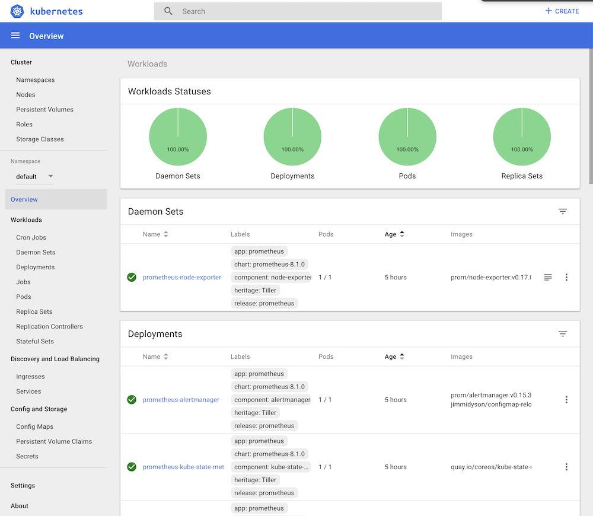

## Setting up Docker, Minikube, and Helm

### Installing Docker

You can install Docker from their [main site](https://www.docker.com/get-started) or if you're on Mac use [homebrew](https://brew.sh):

```
$ /usr/bin/ruby -e "$(curl -fsSL https://raw.githubusercontent.com/Homebrew/install/master/install)"
```

Next let's install Docker:

```
$ brew cask install docker
```

Docker has a visual tool called [Kitematic](https://kitematic.com/) if you like to see what's running and logs in a GUI. To install that run:

```
$ brew cask install kitematic
```

> Now that you have Docker installed, a few things that might help are increasing the available cores and memory to it if you plan to run heavy workloads and disk space. You can do that by going to the preferences from the menu bar.

### Running a Docker image

Docker, out of the box, is pretty powerful and lets you pull images and run them directly. For example, if you wanted to run an instance of mongo db locally you could do the following:

```
$ mkdir -p /tmp/data
$ docker run -d -p 27017:27017 -v ~/tmp/data:/data/db mongo
```

All this tells Docker is to run the `mongo` image (which it will find on the public image registry on Docker Hub). If the image doesn't exist locally, it'll pull _or download_ the image and the run it.  The other parameters like `-d` make it run as detached so execution in this shell can continue and `-p 27017:27017` exposes a port locally into the container.

Docker's container system allows it to basically run an application with ports that aren't automatically accessible outside the container. This is why the dual port notation in the parameters.

Lastly, the `-v ~/tmp/data:/data/db` similarly mounts a volume on the host machine (the first parameter `~/tmp/data`) to the path in the container (the second parameter `/data/db`). We created this initially to make sure it exists.

The `mongo` image is referencing an existing `Dockerfile` likely and it's worth learning about those as well for _dockerizing_ your microservices.

Pretty decent [cheat sheet](https://github.com/wsargent/docker-cheat-sheet) for Docker.

### Running a shell in a Docker container

It's pretty nice to be able to see what's going on in the container once you've run it.

First let's see what docker images are running:
```
$ docker ps
CONTAINER ID        IMAGE               COMMAND                  CREATED             STATUS              PORTS                      NAMES
9a2332e3e6ec        mongo               "docker-entrypoint.s…"   7 minutes ago       Up 7 minutes        0.0.0.0:27017->27017/tcp   silly_benz
```

For the mongo image we just ran, we can run a shell with the following command and it drops us into the container:

```
$ docker exec -it 9a2332e3e6ec /bin/bash
root@9a2332e3e6ec:/#
```

This is using the container id `9a2332e3e6ec`, we could also have used the name `silly_benz` which Docker autocreates if you don't specify a name with `--name` when you run the image. 

Running the mongo client which will automatically connect to the server yields:

```
root@9a2332e3e6ec:/# mongo
MongoDB shell version v4.0.4
connecting to: mongodb://127.0.0.1:27017
Implicit session: session { "id" : UUID("fa16920d-744b-44cc-9342-3a54658c7018") }
MongoDB server version: 4.0.4
Server has startup warnings:
2018-12-09T08:37:42.516+0000 I CONTROL  [initandlisten]
2018-12-09T08:37:42.516+0000 I CONTROL  [initandlisten] ** WARNING: Access control is not enabled for the database.
2018-12-09T08:37:42.516+0000 I CONTROL  [initandlisten] **          Read and write access to data and configuration is unrestricted.
2018-12-09T08:37:42.516+0000 I CONTROL  [initandlisten]
---
Enable MongoDB's free cloud-based monitoring service, which will then receive and display
metrics about your deployment (disk utilization, CPU, operation statistics, etc).

The monitoring data will be available on a MongoDB website with a unique URL accessible to you
and anyone you share the URL with. MongoDB may use this information to make product
improvements and to suggest MongoDB products and deployment options to you.

To enable free monitoring, run the following command: db.enableFreeMonitoring()
To permanently disable this reminder, run the following command: db.disableFreeMonitoring()
---

>
```

Neat huh :yum:

---

### Installing Minikube

Install virtualbox and minikube:

```
$ brew cask install virtualbox
$ brew cask install minikube
```

Install kubectl:

```
$ brew install kubectl
```

Enable default ingress controller in minikube:

```
$ minikube addons enable ingress
```

> The default ingress controller in minikube is [`ingress-nginx`](https://github.com/kubernetes/ingress-nginx) and helps configure inbound requests to reach your services. More info can be found [here](https://medium.com/@awkwardferny/getting-started-with-kubernetes-ingress-nginx-on-minikube-d75e58f52b6c).

You'll want to configure minikube with enough memory and disk space because **once you start it, you'll have to delete the cluster to apply any changes**.

Configure minikube if defaults aren't good enough:

```
$ minikube config set disk-space 100g
$ minikube config set memory 8192
$ minikube config set cpus 2
```

View settings with:

```
$ minikube config view
- disk-size: 100g
- heapster: false
- ingress: true
- memory: 8192
- cpus: 2
```

Start minikube and view dashboard:

```
$ minikube start
$ minikube dashboard
```

At this point your Kubernetes cluster is live :boom: and in action. You will be able to create deployments and run your services in no time.



The dashboard is a fantastic way to see your cluster in action. It can show you probably _everything_ Kubernetes has to offer including access to your pods. More info can be found [here](https://kubernetes.io/docs/tasks/access-application-cluster/web-ui-dashboard/).

### Deleting minikube

If you configure minikube settings like memory for example, you'll need to delete the cluster and recreate one.

To stop minikube just run:

```
minikube stop
```

To delete minikube you can run:
```
minikube delete
```

> Keep in mind every time you do this, you'll need to run `helm init` to install Tiller back into the cluster as well after starting it again.

### Useful kubectl commands

You can access your cluster easily using `kubectl`. It will connect to Kubernetes and allow you to manage the cluster with several commands.

Nodes are _like_ actual machines in a way. To see them, run:

```
$ kubectl get nodes
NAME       STATUS   ROLES    AGE   VERSION
minikube   Ready    master   5d    v1.10.0
```

Kubernetes has the concept of namespaces where you can deploy in the cluster

Get the namespaces with:

```
$ kubectl get namespaces
NAME          STATUS   AGE
default       Active   5d
kube-public   Active   5d
kube-system   Active   5d
kubeapps      Active   5d
```

The first 3 are created by default with minikube and you can deploy your services into `default` or create different namespaces if you please. Note that `default` is the default namespace with `kubectl` commands so if you want to access the others you'll have to pass the namespace as a parameter. The other namespaces have the necessary components running for the Kubernetes cluster to operate.

Get the deployments:

```
$ kubectl get deployments -n kube-system
NAME                       DESIRED   CURRENT   UP-TO-DATE   AVAILABLE   AGE
coredns                    1         1         1            1           5d
default-http-backend       1         1         1            1           5d
kube-dns                   1         1         1            1           5d
kubernetes-dashboard       1         1         1            1           5d
nginx-ingress-controller   1         1         1            1           5d
tiller-deploy              1         1         1            1           5d
```

See the ingresses:

```
$ kubectl get ingresses
NAME                       HOSTS               ADDRESS     PORTS   AGE
chartmuseum-chartmuseum    chartmuseum.local   10.0.2.15   80      8h
grafana                    grafana.local       10.0.2.15   80      8h
prometheus-server          prometheus.local    10.0.2.15   80      5d
registry-docker-registry   registry.local      10.0.2.15   80      8h
```

Finally, see the actual pods using:

```
$ kubectl get pods -o wide
NAME                                             READY   STATUS    RESTARTS   AGE   IP            NODE
busybox                                          1/1     Running   9          12h   172.17.0.25   minikube
chartmuseum-chartmuseum-668cfbd656-8fvbs         1/1     Running   0          8h    172.17.0.24   minikube
grafana-5459f55c75-dcqjk                         1/1     Running   0          8h    172.17.0.23   minikube
mongo-mongodb-5679947c4d-v47p5                   2/2     Running   0          8h    172.17.0.28   minikube
prometheus-alertmanager-d56dc9f5c-fpkb9          2/2     Running   0          5d    172.17.0.20   minikube
prometheus-kube-state-metrics-7cfc844c96-zt2zg   1/1     Running   0          5d    172.17.0.19   minikube
prometheus-node-exporter-qlcmj                   1/1     Running   0          5d    10.0.2.15     minikube
prometheus-pushgateway-748df8f7dd-t5nsq          1/1     Running   0          5d    172.17.0.21   minikube
prometheus-server-5579696bf-zxmx8                2/2     Running   0          5d    172.17.0.22   minikube
redis-master-0                                   1/1     Running   0          8h    172.17.0.27   minikube
redis-metrics-ff54b44f-c9b4z                     1/1     Running   0          8h    172.17.0.26   minikube
registry-docker-registry-794bb87bb9-w6zrj        1/1     Running   0          8h    172.17.0.18   minikube
```

> The `-o wide` shows more information. Additionally you can watch them by just passing in `-w` and `kubectl` will print updates as state changes happen.

`kubectl` has many more commands for creating deployments and other types of resources but since we will be using Helm for the most part to handle that, it's not covered. Be sure to read up on it however since it's important to know how Kubernetes resources are defined via manifest files. More info can be found [here](https://kubernetes.io/docs/reference/kubectl/cheatsheet/).

---

### Installing Helm

Install Helm:

```
$ brew install kubernetes-helm
```

Initialize Helm and install Tiller:

```
$ helm init
```

> This command will install Tiller in your cluster and configure Helm to deploy properly.

Getting the latest charts:

```
$ helm repo update
```

### Deploying Helm Charts

Helm uses charts for deployment. And by default, it adds a chart repository for use.

You can see what charts are available using:

```
$ helm search
NAME                                 	CHART VERSION	APP VERSION                 	DESCRIPTION
bitnami/apache                       	4.0.0        	2.4.37                      	Chart for Apache HTTP Server
bitnami/bitnami-common               	0.0.3        	0.0.1                       	Chart with custom tempaltes used in Bitnami charts.
bitnami/cassandra                    	1.0.0        	3.11.3                      	Apache Cassandra is a free and open-source distributed da...
bitnami/consul                       	3.0.0        	1.4.0                       	Highly available and distributed service discovery and ke...
bitnami/crypto                       	0.0.2        	                            	Get a Crypto currency price
...
```

Installing a chart:

```
$ helm install stable/mariadb
Fetched stable/mariadb-0.3.0 to /Users/mattbutcher/Code/Go/src/k8s.io/helm/mariadb-0.3.0.tgz
NAME: happy-panda
LAST DEPLOYED: Wed Sep 28 12:32:28 2016
NAMESPACE: default
STATUS: DEPLOYED
...
```

> Note you can change the default name like Docker with `--name` if you're not happy with :panda_face:.

Check the status of a deployment:

```
$ helm status happy-panda
Last Deployed: Wed Sep 28 12:32:28 2016
Namespace: default
Status: DEPLOYED
...
```

Now the interesting bit comes when you want to customize the chart since vanilla :icecream: is never fun. Helm lets you inspect the customizable values for the chart as well and you can supply a config YAML with overrides simply.

To inspect chart:

```
$ helm inspect values stable/mariadb
Fetched stable/mariadb-0.3.0.tgz to /Users/mattbutcher/Code/Go/src/k8s.io/helm/mariadb-0.3.0.tgz
## Bitnami MariaDB image version
## ref: https://hub.docker.com/r/bitnami/mariadb/tags/
##
## Default: none
imageTag: 10.1.14-r3

## Specify a imagePullPolicy
## Default to 'Always' if imageTag is 'latest', else set to 'IfNotPresent'
## ref: http://kubernetes.io/docs/user-guide/images/#pre-pulling-images
##
# imagePullPolicy:
...
```

After creating a `custom.yaml` you can install with:

```
$ helm install -f config.yaml stable/mariadb
```

Next you'll want to delete your deployment with:

```
$ helm delete happy-panda
release "happy-panda" deleted
```

> Note since Helm allows you to rollback it keeps a history of all these changes. You'd need to purge the changes as well to remove for good using `--purge`.

---

On to the next section: [Setting up Kubeapps, Prometheus, and Grafana](docs/setup-2.md)