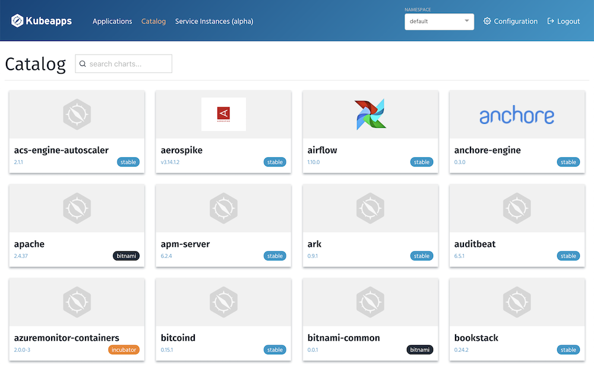
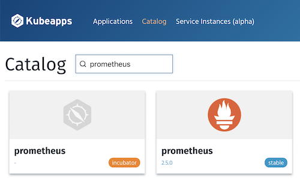
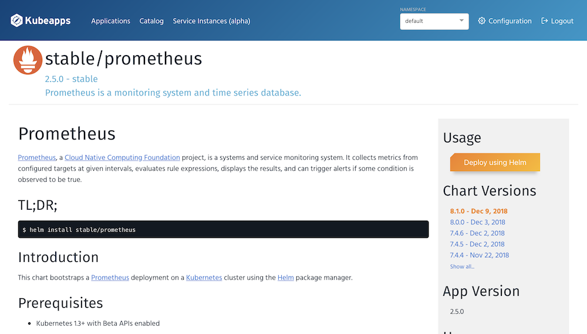
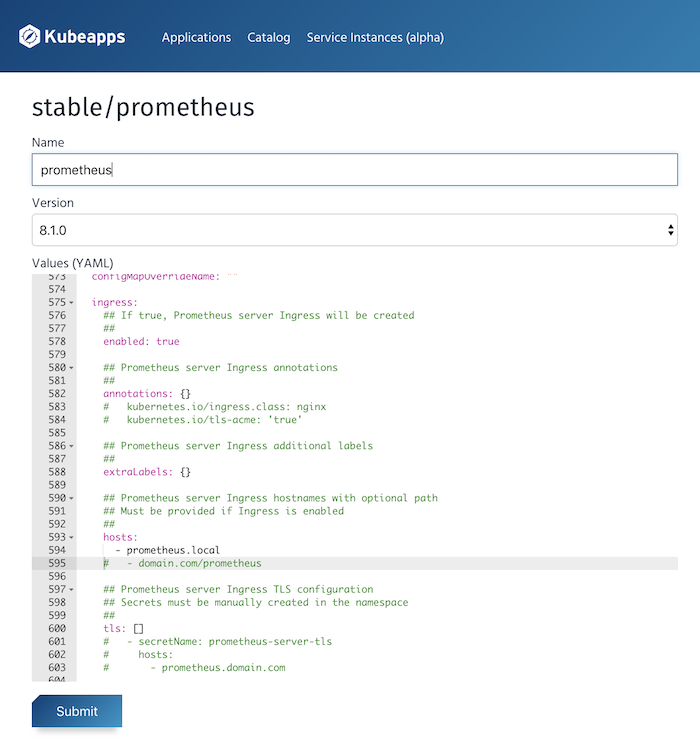

## Setting up Kubeapps, Prometheus, and Grafana

### Installing Kubeapps

Install using:

```
$ helm install --name kubeapps --namespace kubeapps bitnami/kubeapps --set ingress.enabled=true
```

> It seems that along with using a custom YAML file, you can set certain values on the CLI as well using `--set` here.

This will install Kubeapps using `helm` and deploy it in your cluster in a new namespace called `kubeapps`. The value being set for `ingress.enabled=true` will tell expose the underlying service or dashboard that is defined by the chart to the host machine under `kubeapps.local`. However, you'll need to add this entry to point your minikube IP in `/etc/hosts`.

To do this, you can edit `/etc/hosts` directly or execute the following:

```
$ export CLUSTER_IP=$(minikube ip) # On Minikube. Use: `kubectl cluster-info` on others K8s clusters
$ echo "Kubeapps URL: http://kubeapps.local/"
$ echo "$CLUSTER_IP  kubeapps.local" | sudo tee -a /etc/hosts
```

Open a browser and access Kubeapps using the obtained URL. Access to the Dashboard requires a Kubernetes API token to authenticate with the Kubernetes API server.

Create the service account and role in Kubernetes:

```
$ kubectl create serviceaccount kubeapps-operator
$ kubectl create clusterrolebinding kubeapps-operator --clusterrole=cluster-admin --serviceaccount=default:kubeapps-operator
```

Get the token:

```
$ kubectl get secret $(kubectl get serviceaccount kubeapps-operator -o jsonpath='{.secrets[].name}') -o jsonpath='{.data.token}' | base64 --decode
```

> Pipe the last value into `pbcopy` and paste into the browser directly.

At this point you should see the dashboard after entering the key. Navigate to the Catalog tab.



### Deleting Kubeapps

If for whatever reason you want to clean up Kubeapps you can do the following to accomplish that:

```
$ helm delete --purge kubeapps
$ kubectl delete crd apprepositories.kubeapps.com
$ kubectl delete namespace kubeapps
```

### Installing Prometheus

Let's use Kubeapps to install Prometheus. The nice thing about Kubeapps is that it let's you customize the Helm chart on the dashboard UI before deploying in your cluster.

For Prometheus we'll also set it up with ingress to that we can access it directly from our host machine. This makes it easier to use without having to port forward.

> Inside your Kubernetes cluster, all of your services and pods have DNS names associated making them accessible within the cluster. For services they follow the format of `my-svc.my-namespace.svc.cluster.local` and pods would likely be `pod-ip-address.my-namespace.pod.cluster.local` but gets more complicated with hostnames etc. See more info [here](https://kubernetes.io/docs/concepts/services-networking/dns-pod-service/).

Search for "prometheus" in the field and click on the one with the `stable` label on the card. We'll install on the stable versions, there's also `bitnami` and `incubator` but not sure what those are.



Next you'll see detailed information about the Helm chart for Prometheus and configuration parameters along with many other goodies worth reading. Click the "Deploy using Helm" button on the top right.



This brings you to the customization page where you can modify any of the values used by `helm` to ensure a deployment that suits your needs. We'll want to name our deployment something and peruse through the YAML and configure a view things. For one, we'll want to enable ingress and set the `hosts` value to `prometheus.local`.



Part of the YAML under the `service` node needs to be updated to indicate that we want to enable ingress. The default value for `enabled` is `false` so needs to change. Additionally the `hosts` is an empty array `[]` so remove that and add an item for `prometheus.local` underneath. It appears like this after updating:

```
  ingress:
    ## If true, Prometheus server Ingress will be created
    ##
    enabled: true

    ## Prometheus server Ingress annotations
    ##
    annotations: {}
    #   kubernetes.io/ingress.class: nginx
    #   kubernetes.io/tls-acme: 'true'

    ## Prometheus server Ingress additional labels
    ##
    extraLabels: {}

    ## Prometheus server Ingress hostnames with optional path
    ## Must be provided if Ingress is enabled
    ##
    hosts:
      - prometheus.local
    #   - domain.com/prometheus
```

> Since Helm charts and the values seem to be rendered as template variables, they can likely be whatever developers set them to be. It appears there is some consistency though in the naming of these configurable parameters but not always the same. You'll have to figure out what the parameter is meant to be based on the information available.

Submit the Helm deployment and review the post-install notes provided by `helm`.